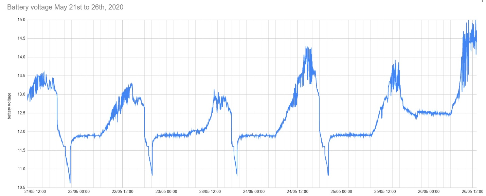
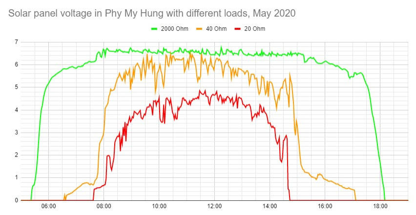
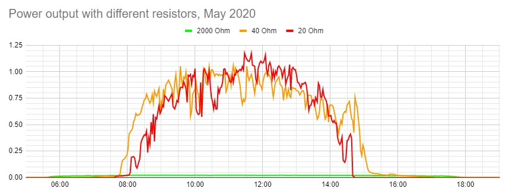
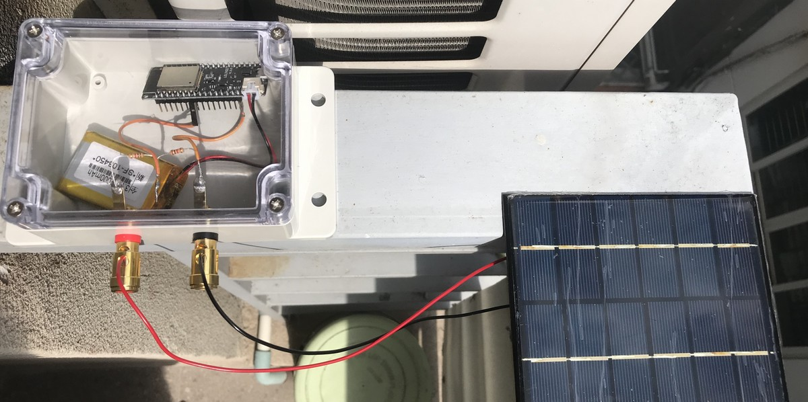
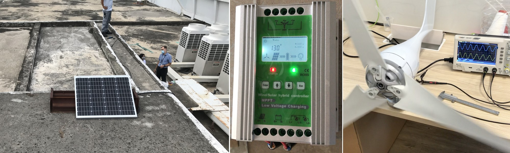

# Solarpower at AISVN

[](https://GitHub.com/aisvn-data/solarpower/releases/)
[](https://aisvn-data.mit-license.org/)
[](https://github.com/aisvn-data/solarpower/actions/workflows/jekyll-gh-pages.yml)

Collect data from solar panel and wind generator at AISVN - project for IB Physics. Here the battery voltage over the first week:



# Pictures for solarpower

We collected some data over time:





## Setup Phu My Hung



This setup collected data from 2020 to December 2023. Then IFTT deactivated the webhook functionality to process signals into a Google sheet. Work will continue.

## Setup AISVN



## Code

``` c
// Solarmeter first attempt (all Serial.print removed), inspired by 
// https://randomnerdtutorials.com/esp32-esp8266-publish-sensor-readings-to-google-sheets/
 
#include <WiFi.h>
#include <Wire.h>

const char* ssid     = "REPLACE_WITH_YOUR_SSID";
const char* password = "REPLACE_WITH_YOUR_PASSWORD";
const char* resource = "/trigger/value/with/key/place-here";
const char* server = "maker.ifttt.com";

uint64_t uS_TO_S_FACTOR = 1000000;  // Conversion factor for micro seconds to seconds
uint64_t TIME_TO_SLEEP = 120;
int adcValue = 0;

void setup() {
  delay(1000);
  initWifi();
  makeIFTTTRequest();
  esp_sleep_enable_timer_wakeup(TIME_TO_SLEEP * uS_TO_S_FACTOR);    
  esp_deep_sleep_start(); // start deep sleep for 120 seconds (2 minutes)
}

void loop() {  // sleeping so wont get here
}

void initWifi() {  // Establish a Wi-Fi connection with your router
  WiFi.begin(ssid, password);  
  int timeout = 10 * 4; // 10 seconds
  while(WiFi.status() != WL_CONNECTED  && (timeout-- > 0)) {
    delay(250);
  }
}

void makeIFTTTRequest() {  // Make an HTTP request to the IFTTT web service
  WiFiClient client;
  int retries = 5;

  // raw and converted voltage reading
  adcValue = analogRead( 34 );
  String jsonObject = String("{\"value1\":\"") + adcValue + "\",\"value2\":\"" 
    + (adcValue * 2.4)   + "\",\"value3\":\"" + millis() + "\"}";
  
  client.println(String("POST ") + resource + " HTTP/1.1");
  client.println(String("Host: ") + server); 
  client.println("Connection: close\r\nContent-Type: application/json");
  client.print("Content-Length: ");
  client.println(jsonObject.length());
  client.println();
  client.println(jsonObject);
        
  int timeout = 5 * 10; // 5 seconds             
  while(!!!client.available() && (timeout-- > 0)){
    delay(100);
  }
  client.stop(); 
}
```
