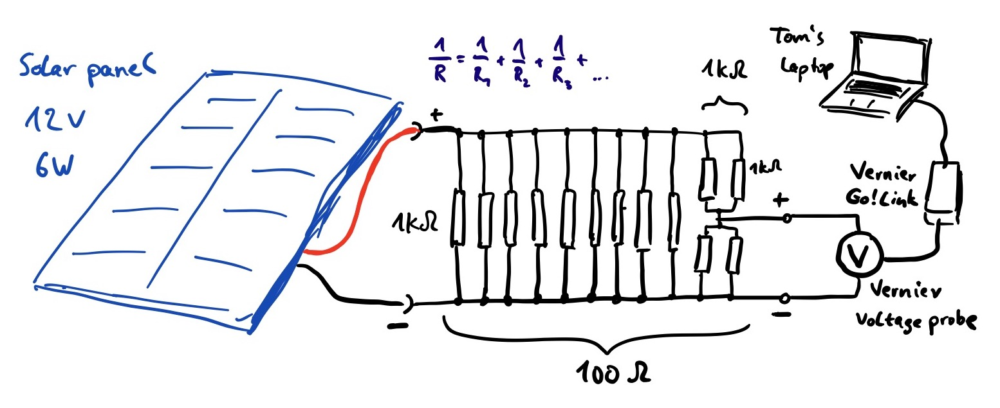

# Pictures for solarpower

We collected some data over time:

## Setup Phu My Hung

## Setup AISVN

## Electric circuit design

Before starting the wiring we created a sketch of the proposed connections:

## Measurement data

This is the first measured data from May 2020:

